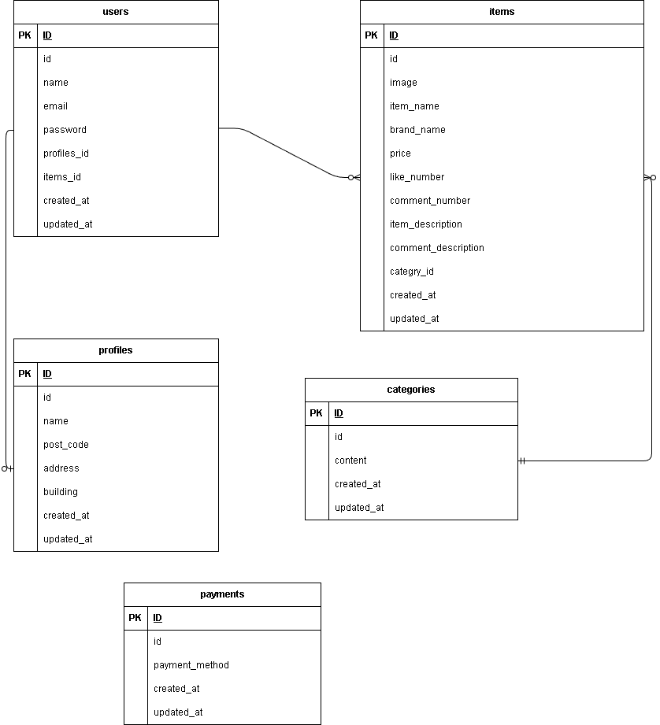

# COACHTECH(フリマアプリ)

## 概要

商品を出品・購入できるフリマアプリです。
会員登録、メール認証、商品検索、いいね、コメント、購入などの機能を実装しています。

## 環境構築
**Dockerビルド**
1. `git clone git@github.com:sophy-iu/market-app.git`
2.  cd market-app
3.  DockerDesktopアプリを立ち上げる
4. `docker-compose up -d --build`

> *MacのM1・M2チップのPCの場合、`no matching manifest for linux/arm64/v8 in the manifest list entries`のメッセージが表示されビルドができないことがあります。
エラーが発生する場合は、docker-compose.ymlファイルの「mysql」内に「platform」の項目を追加で記載してください*
``` bash
mysql:
    platform: linux/x86_64(この文追加)
    image: mysql:8.0.26
    environment:
```

**Laravel環境構築**
1. `docker-compose exec php bash`
2. `composer install`
3. 「.env.example」ファイルを 「.env」ファイルに命名を変更。または、新しく.envファイルを作成
    `cp .env.example .env`
4. .envに以下の環境変数を追加
``` text
DB_CONNECTION=mysql
DB_HOST=mysql
DB_PORT=3306
DB_DATABASE=laravel_db
DB_USERNAME=laravel_user
DB_PASSWORD=laravel_pass
```
```
MAIL_MAILER=smtp
MAIL_HOST=mailhog
MAIL_PORT=1025
MAIL_USERNAME=null
MAIL_PASSWORD=null
MAIL_ENCRYPTION=null
MAIL_FROM_ADDRESS=noreply@example.com
MAIL_FROM_NAME="${APP_NAME}"
```

5. アプリケーションキーの作成
``` bash
php artisan key:generate
```

6. マイグレーションの実行
``` bash
php artisan migrate
```

7. シーディングの実行
``` bash
php artisan db:seed
```

## 使用技術(実行環境)
- PHP8.1.34
- Laravel8.83.29
- MySQL8.0.26
- Nginx 1.21.1
- Docker / Docker Compose
- Laravel Fortify
- MailHog

## ER図


## URL
- 開発環境：http://localhost/
- phpMyAdmin:http://localhost:8080/
- MailHog：http://localhost:8025/

## テストユーザー
1. メールアドレス：test@example.com
    パスワード：password123

## その他
- メール認証はmailhog使用
- コーチとの相談により、商品購入画面の表示切り替えにはJavaScriptを使用しています。
- テストケースに「会員情報が登録され、プロフィール設定画面に遷移する」とあるが、メール認証機能を付属しているので、会員登録後、メール認証画面に遷移するようテストを変更している。